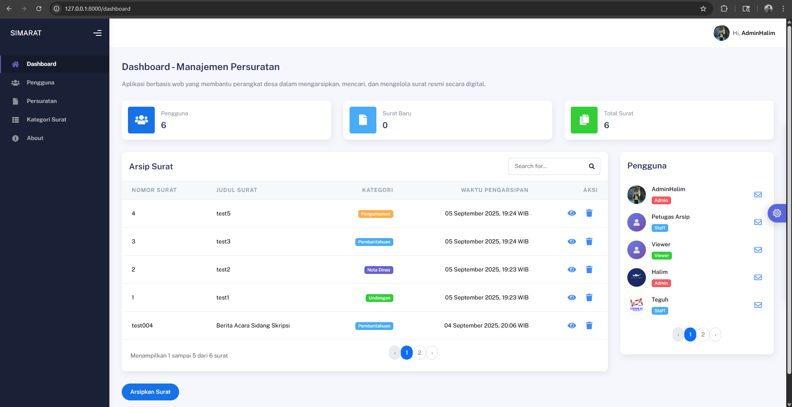
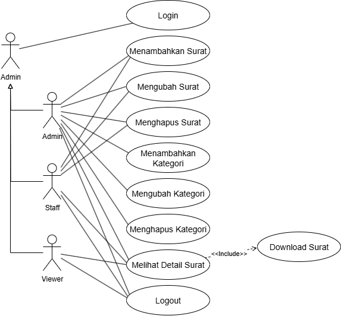

# 🌐 SIMARAT — Sistem Informasi Persuratan


**SIMARAT (Sistem Informasi Persuratan)** adalah aplikasi berbasis web yang membantu perangkat desa dalam **mengarsipkan, mencari, dan mengelola surat resmi** secara digital.  
Setiap surat bisa dipindai menjadi **PDF**, lalu diunggah ke sistem dengan kategori tertentu seperti *Undangan*, *Pengumuman*, *Nota Dinas*, atau *Pemberitahuan*.  

Dengan fitur pencarian, preview PDF, dan manajemen user berbasis role, SIMARAT menjadikan proses persuratan lebih **efisien, transparan, dan aman**.

---

## ✨ Fitur Utama
- 📄 **Manajemen Surat**: CRUD, upload PDF, preview & download  
- 🗂️ **Kategori Surat**: Kelola kategori (Undangan, Pengumuman, dsb)  
- 👥 **Manajemen Pengguna**: Role-based access (Admin, Staff, Viewer)  
- 🔎 **Pencarian Surat**: Filter cepat berdasarkan judul/kategori  
- 🎨 **UI Modern**: Tailwind CSS + SweetAlert interaktif  
- ℹ️ **About Us Page**: Informasi pengembang & kontak  

---

## 🔐 Hak Akses SIMARAT
| Role | Hak Akses |  
|------|-----------|  
| **Admin** | CRUD surat, kategori, user; import, hapus, download, preview, pencarian |  
| **Staff** | Tambah/Edit surat, upload PDF, preview & download, pencarian |  
| **Viewer** | Hanya bisa preview & download surat, pencarian |  

---

## 🖼️ Preview

### Dashboard Ringkasan


### Daftar Surat


### Manajemen User


---

## 🗂️ Arsitektur Sistem

### Use Case Diagram


### Entity Relational Diagram


---

## 🛠️ Tech Stack
- **Backend**: Laravel 11 (PHP 8.2/8.3)  
- **Frontend**: TailwindCSS + Livewire v3  
- **DB**: MySQL 8  
- **Storage**: Laravel Filesystem (local/private)  
- **Auth & Role**: middleware laravel  
- **Notifikasi**: SweetAlert2  

---

## 🚀 Instalasi
1. Clone repo:
   ```bash
   git clone https://github.com/username/simarat.git
   cd simarat
   ```
   
2. Install dependency:
    ```
    composer install
    npm install && npm run dev
    ```

3. Salin file .env.example ke .env, lalu sesuaikan konfigurasi DB.

4. Generate key & migrate DB:
    ```
    php artisan key:generate
    php artisan migrate --seed
    ```

5. Jalankan server:
    ```
    php artisan serve
    ```

🤝 Kontribusi

Pull request terbuka untuk perbaikan bug atau penambahan fitur.
Silakan fork repo ini dan ajukan PR dengan perubahan Anda.
